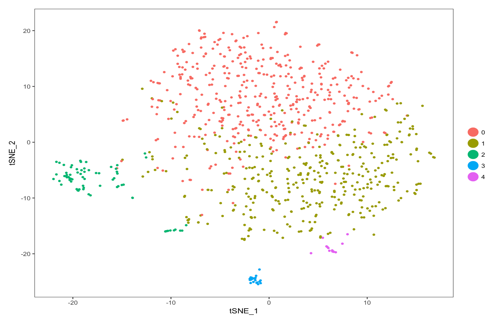

# Rcourse

# My repository created for the R vacation school

Trying out some emoji :smile:

Here I will *commit*, _pull_ and *push* plaintext documents and `code`.   



A typo

A wonderful new line of text in RStudio

Another line added in the browser

## Evaluated R code

The `chickwts` dataset in R has `r nrow(chickwts)` rows.

```{r chickplot}
plot(chickwts$weight ~ chickwts$feed,
     xlab = 'Feed type',
     ylab = 'Weight (grams)',
     col = 2:7)
```    


