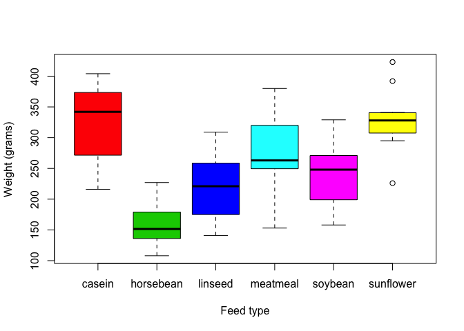

Rcourse
=======

My repository created for the R vacation school
===============================================

Trying out some emoji :smile:

Here I will *commit*, *pull* and *push* plaintext documents and `code`.


A typo

A wonderful new line of text in RStudio

Another line added in the browser

Evaluated R code
----------------

The `chickwts` dataset in R has 71 rows.

``` r
plot(chickwts$weight ~ chickwts$feed,
     xlab = 'Feed type',
     ylab = 'Weight (grams)',
     col = 2:7)
```


